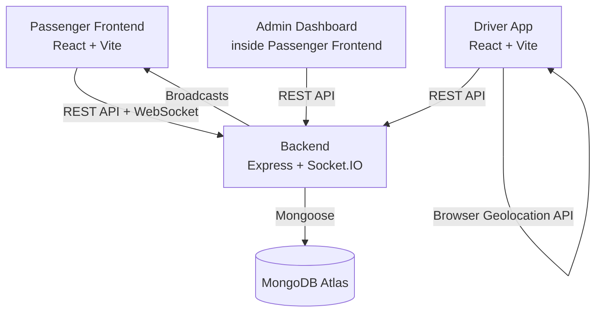
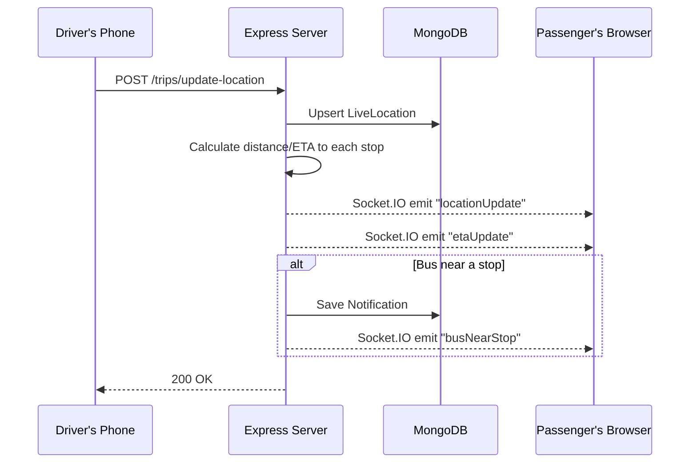

# System Architecture

## High-Level Overview

Three independent applications share one backend:

## Data Flow: Live Location Update

## Why Three Separate Apps
- **Backend**: long-running Node process, required for persistent Socket.IO connections
- **Passenger Frontend**: desktop/mobile browser, map-heavy
- **Driver App**: mobile-first, GPS-focused, deliberately lightweight (no map library)

## Authentication Flow
JWT-based, stateless. Token issued on login/register, stored in `localStorage`, attached via `Authorization: Bearer <token>` header on every request (via axios interceptor). Role (`passenger`/`driver`/`admin`) embedded in token payload and re-verified against the database on every protected request.

## Real-Time Layer
Socket.IO rooms scope broadcasts: `bus-<busId>` rooms let passengers subscribe only to buses they're tracking; `admin-room` lets the admin dashboard see everything at once.