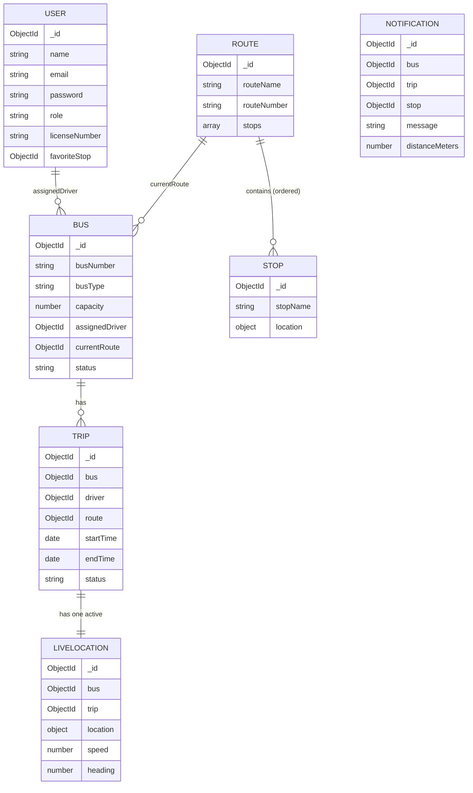

# Database Design

## Collections & Relationships

## Design Decisions

**Single User model with a `role` field** — instead of separate User/Driver/Admin collections, one model serves all three, distinguished by `role: "passenger" | "driver" | "admin"`. Avoids duplicate login logic.

**Separate Trip vs LiveLocation** — Trip is a permanent historical record; LiveLocation is a single, constantly-overwritten "current position" document per bus (enforced via `unique: true` + upsert), since only the latest GPS point matters for live tracking.

**GeoJSON for locations** — Stop and LiveLocation store coordinates in GeoJSON `Point` format (`[longitude, latitude]`), enabling MongoDB's `2dsphere` geospatial indexing for future proximity queries.